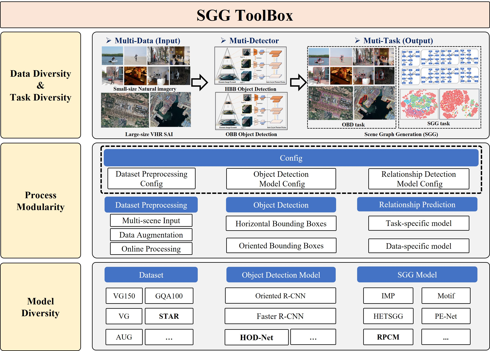

[](https://github.com/Zhuzi24/SGG-ToolKit?tab=Apache-2.0-1-ov-file)
[](https://github.com/Zhuzi24/SGG-ToolKit)
   

<h1 style="text-align: center;">STAR: A First-Ever Dataset and A Large-Scale Benchmark for Scene Graph Generation in Large-Size Satellite Imagery</h1>

The official implementation of the paper "STAR: A First-Ever Dataset and A Large-Scale Benchmark for Scene Graph Generation in Large-Size Satellite Imagery".

## 📢 Latest Updates
:fire::fire::fire: Last Updated on 2024-08-05 :fire::fire::fire:

📆 [**2024-08-05**] : We open-source the object detection dataset and evaluation port of STAR, see "Download Links" in https://linlin-dev.github.io/project/STAR.html.

📆 [**2024-07-04**] : Update paper on arxiv, see [click here](https://arxiv.org/abs/2406.09410)

📆 [**2024-06-14**] : Our paper is available open on arxiv, [click here](https://arxiv.org/abs/2406.09410) to go to it!

📆 [**2024-06-13**] : Update project.

## 🚀🚀🚀 Highlights

We construct STAR, the first large-scale dataset for scene graph generation in large-size VHR SAI. Containing  more than  `210,000` objects and over `400,000` triplets for SGG in large-size VHR SAI.

<p align="center">
 
</p>

[https://private-user-images.githubusercontent.com/29257168/339049597-2d027f2c-8911-45ba-b4dd-7f95111465a9.mp4](https://private-user-images.githubusercontent.com/29257168/345304070-0d1b8726-5a46-4182-95b9-bc70a050e49b.mp4)


## 📌 Abstract
Scene graph generation (SGG) in satellite imagery (SAI) benefits promoting understanding of geospatial scenarios from perception to cognition. In SAI, objects exhibit great variations in scales and aspect ratios, and there exist rich relationships between objects (even between spatially disjoint objects), which makes it attractive to holistically conduct SGG in large-size very-high-resolution (VHR) SAI. However, there lack such SGG datasets. Due to the complexity of large-size SAI, mining triplets <subject, relationship, object> heavily relies on long-range contextual reasoning. Consequently, SGG models designed for small-size natural imagery are not directly applicable to large-size SAI. This paper constructs a large-scale dataset for SGG in large-size VHR SAI with image sizes ranging from <b>512 × 768</b> to <b>27,860 × 31,096</b> pixels, named <b>STAR</b> (<b>S</b>cene graph genera<b>T</b>ion in l<b>A</b>rge-size satellite image<b>R</b>y), encompassing over <b>210K</b> objects and over <b>400K</b> triplets. To realize SGG in large-size SAI, we propose a context-aware cascade cognition (CAC) framework to understand SAI regarding object detection (OBD), pair pruning and relationship prediction for SGG. We also release a SAI-oriented SGG toolkit with about <b>30</b> OBD and <b>10</b> SGG methods which need further adaptation by our devised modules on our challenging STAR dataset. **The STAR dataset will be made publicly available at [STAR](https://linlin-dev.github.io/project/STAR.html)**.

## 📝 Overview of ToolBox
<p align="center">
 
</p>

## 🛠️ Installation
Check [INSTALL.md](INSTALL.md) for installation instructions.

## 🔖 Dataset
Check [DATASET.md](DATASET.md) for instructions of dataset preprocessing.

## ✏️ Metrics and Results
Explanation of metrics in our toolkit and reported results for OBD and SGG are given in [METRICS.md](METRICS.md). 

## ✒️ Object Detection
If you are only involved in OBB/HBB object detection, you can refer to [STAR-MMRotate](https://github.com/yangxue0827/STAR-MMRotate) and [STAR-MMDetection](https://github.com/Zhuzi24/STAR-MMDetection).

<!-- ### Oriented Object Detection

|  Detector  | mAP | Configs | Download | Note |
| :--------: |:---:|:-------:|:--------:|:----:|
| Deformable DETR | 17.1 | [deformable_detr_r50_1x_rsg](configs/ars_detr/deformable_detr_r50_1x_rsg.py) | [log](https://huggingface.co/yangxue/STAR-MMRotate/raw/main/deformable_detr_r50_1x_rsg.log) \| [ckpt](https://huggingface.co/yangxue/STAR-MMRotate/resolve/main/deformable_detr_r50_1x_rsg-fe862bb3.pth?download=true) |
| ARS-DETR | 28.1 | [dn_arw_arm_arcsl_rdetr_r50_1x_rsg](configs/ars_detr/dn_arw_arm_arcsl_rdetr_r50_1x_rsg.py) | [log](https://huggingface.co/yangxue/STAR-MMRotate/raw/main/dn_arw_arm_arcsl_rdetr_r50_1x_rsg.log) \| [ckpt](https://huggingface.co/yangxue/STAR-MMRotate/resolve/main/dn_arw_arm_arcsl_rdetr_r50_1x_rsg-cbb34897.pth?download=true) |
| RetinaNet | 21.8 | [rotated_retinanet_hbb_r50_fpn_1x_rsg_oc](configs/rotated_retinanet/rotated_retinanet_hbb_r50_fpn_1x_rsg_oc.py) | [log](https://huggingface.co/yangxue/STAR-MMRotate/raw/main/rotated_retinanet_hbb_r50_fpn_1x_rsg_oc.log) \| [ckpt](https://huggingface.co/yangxue/STAR-MMRotate/resolve/main/rotated_retinanet_hbb_r50_fpn_1x_rsg_oc-3ec35d77.pth?download=true) |
| ATSS | 20.4 | [rotated_atss_hbb_r50_fpn_1x_rsg_oc](configs/rotated_atss/rotated_atss_hbb_r50_fpn_1x_rsg_oc.py) | [log](https://huggingface.co/yangxue/STAR-MMRotate/raw/main/rotated_atss_hbb_r50_fpn_1x_rsg_oc.log) \| [ckpt](https://huggingface.co/yangxue/STAR-MMRotate/resolve/main/rotated_atss_hbb_r50_fpn_1x_rsg_oc-f65f07c2.pth?download=true) | 
|  KLD  |  25.0  |   [rotated_retinanet_hbb_kld_r50_fpn_1x_rsg_oc](configs/kld/rotated_retinanet_hbb_kld_r50_fpn_1x_rsg_oc.py)  |  [log](https://huggingface.co/yangxue/STAR-MMRotate/raw/main/rotated_retinanet_hbb_kld_r50_fpn_1x_rsg_oc.log) \| [ckpt](https://huggingface.co/yangxue/STAR-MMRotate/resolve/main/rotated_retinanet_hbb_kld_r50_fpn_1x_rsg_oc-343a0b83.pth?download=true) |
|  GWD  |  25.3  |   [rotated_retinanet_hbb_gwd_r50_fpn_1x_rsg_oc](configs/gwd/rotated_retinanet_hbb_gwd_r50_fpn_1x_rsg_oc.py)  |  [log](https://huggingface.co/yangxue/STAR-MMRotate/raw/main/rotated_retinanet_hbb_gwd_r50_fpn_1x_rsg_oc.log) \| [ckpt](https://huggingface.co/yangxue/STAR-MMRotate/resolve/main/rotated_retinanet_hbb_gwd_r50_fpn_1x_rsg_oc-566d2398.pth?download=true) |
| KFIoU |  25.5  |   [rotated_retinanet_hbb_kfiou_r50_fpn_1x_rsg_oc](configs/kfiou/rotated_retinanet_hbb_kfiou_r50_fpn_1x_rsg_oc.py)  |  [log](https://huggingface.co/yangxue/STAR-MMRotate/raw/main/rotated_retinanet_hbb_kfiou_r50_fpn_1x_rsg_oc.log) \| [ckpt](https://huggingface.co/yangxue/STAR-MMRotate/resolve/main/rotated_retinanet_hbb_kfiou_r50_fpn_1x_rsg_oc-198081a6.pth?download=true) |
| S2A-Net | 27.3 | [s2anet_r50_fpn_1x_rsg_le135](configs/s2anet/s2anet_r50_fpn_1x_rsg_le135.py) | [log](https://huggingface.co/yangxue/STAR-MMRotate/raw/main/s2anet_r50_fpn_1x_rsg_le135.log) \| [ckpt](https://huggingface.co/yangxue/STAR-MMRotate/resolve/main/s2anet_r50_fpn_1x_rsg_le135-42887a81.pth?download=true) |
| FCOS  |  28.1  |   [rotated_fcos_r50_fpn_1x_rsg_le90](configs/rotated_fcos/rotated_fcos_r50_fpn_1x_rsg_le90.py)  |  [log](https://huggingface.co/yangxue/STAR-MMRotate/raw/main/rotated_fcos_r50_fpn_1x_rsg_le90.log) \| [ckpt](https://huggingface.co/yangxue/STAR-MMRotate/resolve/main/rotated_fcos_r50_fpn_1x_rsg_le90-a579fbf7.pth?download=true) | 
| CSL | 27.4 | [rotated_fcos_csl_gaussian_r50_fpn_1x_rsg_le90](configs/rotated_fcos/rotated_fcos_csl_gaussian_r50_fpn_1x_rsg_le90.py) | [log](https://huggingface.co/yangxue/STAR-MMRotate/raw/main/rotated_fcos_csl_gaussian_r50_fpn_1x_rsg_le90.log) \| [ckpt](https://huggingface.co/yangxue/STAR-MMRotate/resolve/main/rotated_fcos_csl_gaussian_r50_fpn_1x_rsg_le90-6ab9a42a.pth?download=true) | 
| RepPoints  | 19.7 | [rotated_reppoints_r50_fpn_1x_rsg_oc](configs/rotated_reppoints/rotated_reppoints_r50_fpn_1x_rsg_oc.py) | [log](https://huggingface.co/yangxue/STAR-MMRotate/raw/main/rotated_reppoints_r50_fpn_1x_rsg_oc.log) \| [ckpt](https://huggingface.co/yangxue/STAR-MMRotate/resolve/main/rotated_reppoints_r50_fpn_1x_rsg_oc-7a6c59b9.pth?download=true) |
| CFA | 25.1 | [cfa_r50_fpn_1x_rsg_le135](configs/cfa/cfa_r50_fpn_1x_rsg_le135.py) | [log](https://huggingface.co/yangxue/STAR-MMRotate/raw/main/cfa_r50_fpn_1x_rsg_le135.log) \| [ckpt](https://huggingface.co/yangxue/STAR-MMRotate/resolve/main/cfa_r50_fpn_1x_rsg_le135-287f6b84.pth?download=true) |
| Oriented RepPoints  |  27.0  |   [oriented_reppoints_r50_fpn_1x_rsg_le135](configs/oriented_reppoints/oriented_reppoints_r50_fpn_1x_rsg_le135.py)  |  [log](https://huggingface.co/yangxue/STAR-MMRotate/raw/main/oriented_reppoints_r50_fpn_1x_rsg_le135.log) \| [ckpt](https://huggingface.co/yangxue/STAR-MMRotate/resolve/main/oriented_reppoints_r50_fpn_1x_rsg_le135-06389ea6.pth?download=true) | |
| SASM  |  28.2  |   [sasm_reppoints_r50_fpn_1x_rsg_oc](configs/sasm_reppoints/sasm_reppoints_r50_fpn_1x_rsg_oc.py)  |  [log](https://huggingface.co/yangxue/STAR-MMRotate/raw/main/sasm_reppoints_r50_fpn_1x_rsg_oc.log) \| [ckpt](https://huggingface.co/yangxue/STAR-MMRotate/resolve/main/sasm_reppoints_r50_fpn_1x_rsg_oc-4f1ca558.pth?download=true) | [p_bs=2](https://github.com/yangxue0827/STAR-MMRotate/blob/05c0064cbcd5c44437321b50e1d2d4ee9b4445db/mmrotate/models/detectors/single_stage_crop.py#L310) |
| Faster RCNN | 32.6 | [rotated_faster_rcnn_r50_fpn_1x_rsg_le90](configs/rotated_faster_rcnn/rotated_faster_rcnn_r50_fpn_1x_rsg_le90.py) | [log](https://huggingface.co/yangxue/STAR-MMRotate/raw/main/rotated_faster_rcnn_r50_fpn_1x_rsg_le90.log) \| [ckpt](https://huggingface.co/yangxue/STAR-MMRotate/resolve/main/rotated_faster_rcnn_r50_fpn_1x_rsg_le90-9a832bc2.pth?download=true) |
| Gliding Vertex | 30.7 | [gliding_vertex_r50_fpn_1x_rsg_le90](configs/gliding_vertex/gliding_vertex_r50_fpn_1x_rsg_le90.py) | [log](https://huggingface.co/yangxue/STAR-MMRotate/raw/main/gliding_vertex_r50_fpn_1x_rsg_le90.log) \| [ckpt](https://huggingface.co/yangxue/STAR-MMRotate/resolve/main/gliding_vertex_r50_fpn_1x_rsg_le90-5c0bc879.pth?download=true) |
| Oriented RCNN | 33.2 | [oriented_rcnn_r50_fpn_1x_rsg_le90](configs/oriented_rcnn/oriented_rcnn_r50_fpn_1x_rsg_le90.py) | [log](https://huggingface.co/yangxue/STAR-MMRotate/raw/main/oriented_rcnn_r50_fpn_1x_rsg_le90.log) \| [ckpt](https://huggingface.co/yangxue/STAR-MMRotate/resolve/main/oriented_rcnn_r50_fpn_1x_rsg_le90-0b66f6a4.pth?download=true) |
| RoI Transformer | 35.7 | [roi_trans_r50_fpn_1x_rsg_le90](configs/roi_trans/roi_trans_r50_fpn_1x_rsg_le90.py) | [log](https://huggingface.co/yangxue/STAR-MMRotate/raw/main/roi_trans_r50_fpn_1x_rsg_le90.log) \| [ckpt](https://huggingface.co/yangxue/STAR-MMRotate/resolve/main/roi_trans_r50_fpn_1x_rsg_le90-e42f64d6.pth?download=true) |
| ReDet | 39.1 | [redet_re50_refpn_1x_rsg_le90](configs/redet/redet_re50_refpn_1x_rsg_le90.py) | [log](https://huggingface.co/yangxue/STAR-MMRotate/raw/main/redet_re50_refpn_1x_rsg_le90.log) \| [ckpt](https://huggingface.co/yangxue/STAR-MMRotate/resolve/main/redet_re50_refpn_1x_rsg_le90-d163f450.pth?download=true) | [ReResNet50](https://huggingface.co/yangxue/STAR-MMRotate/resolve/main/re_resnet50_c8_batch256-25b16846.pth?download=true) |
| Oriented RCNN | 40.7 | [oriented_rcnn_swin-l_fpn_1x_rsg_le90](configs/oriented_rcnn/oriented_rcnn_swin-l_fpn_1x_rsg_le90.py) | [log](https://huggingface.co/yangxue/STAR-MMRotate/raw/main/oriented_rcnn_swin-l_fpn_1x_rsg_le90.log) \| [ckpt](https://huggingface.co/yangxue/STAR-MMRotate/resolve/main/oriented_rcnn_swin-l_fpn_1x_rsg_le90-fe6f9e2d.pth?download=true) | [Swin-L](https://huggingface.co/yangxue/STAR-MMRotate/resolve/main/swin_large_patch4_window7_224_22k_20220412-aeecf2aa.pth?download=true) | -->

## 🖊️ Citation

If you find this work helpful for your research, please consider giving this repo a star ⭐ and citing our papers:

```bibtex
@article{li2024scene,
    title={STAR: A First-Ever Dataset and A Large-Scale Benchmark for Scene Graph Generation in Large-Size Satellite Imagery},
    author={Li, Yansheng and Wang, Linlin and Wang, Tingzhu and Yang, Xue and Luo, Junwei and Wang, Qi and Deng, Youming and Wang, Wenbin and Sun, Xian and Li, Haifeng and Dang, Bo and Zhang, Yongjun and Yu, Yi and Yan Junchi},
    journal={arXiv preprint arXiv:2406.09410},
    year={2024}}

@article{li2024fine,
  title={Fine-Grained Scene Graph Generation via Sample-Level Bias Prediction},
  author={Li, Yansheng and Wang, Tingzhu and Wu, Kang and Wang, Linlin and Guo, Xin and Wang, Wenbin},
  journal={arXiv preprint arXiv:2407.19259},
  year={2024}}

@article{luo2024sky,
    title={SkySenseGPT: A Fine-Grained Instruction Tuning Dataset and Model for Remote Sensing Vision-Language Understanding},
    author={Luo, Junwei and Pang, Zhen and Zhang, Yongjun and Wang, Tingzhu and Wang, Linlin and Dang, Bo and Lao, Jiangwei and Wang, Jian and Chen, Jingdong and Tan, Yihua and Li, Yansheng},
    journal={arXiv preprint arXiv:2406.10100},
    year={2024}}

@article{li2024learning,
    title={Learning to Holistically Detect Bridges From Large-Size VHR Remote Sensing Imagery},
    author={Li, Yansheng and Luo, Junwei and Zhang, Yongjun and Tan, Yihua and Yu, Jin-Gang and Bai, Song},
    journal={IEEE Transactions on Pattern Analysis and Machine Intelligence},
    volume={44},
    number={11},
    pages={7778--7796},
    year={2024},
    publisher={IEEE}}

@inproceedings{deng2022hierarchical,
    title={Hierarchical Memory Learning for Fine-grained Scene Graph Generation},
    author={Deng, Youming and Li, Yansheng and Zhang, Yongjun and Xiang, Xiang and Wang, Jian and Chen, Jingdong and Ma, Jiayi},
    booktitle={European Conference on Computer Vision},
    pages={266--283},
    year={2022},
    organization={Springer}}


```
## Acknowledgment
Our code is based on [Scene-Graph-Benchmark.pytorch](https://github.com/KaihuaTang/Scene-Graph-Benchmark.pytorch), [MMDetection](https://github.com/open-mmlab/mmdetection) and [MMRotate](https://github.com/open-mmlab/mmrotate), we sincerely thank them.
<!-- ## 📃 License

This project is released under the [Apache license](LICENSE). Parts of this project contain code and models from other sources, which are subject to their respective licenses. -->

# ⭐️ Star History

[](https://star-history.com/#Zuzhi/SGG-ToolKit&Date)
